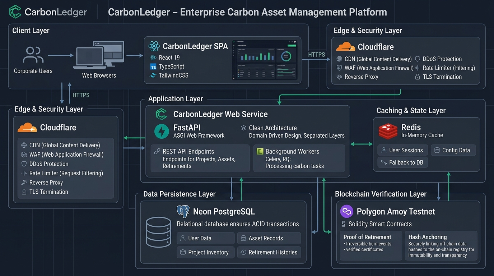
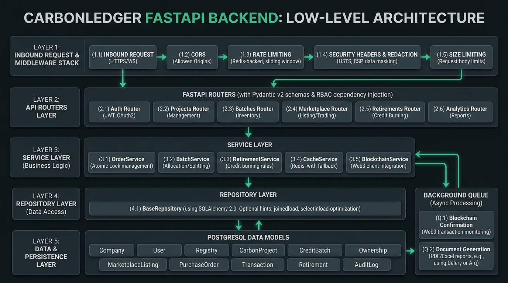
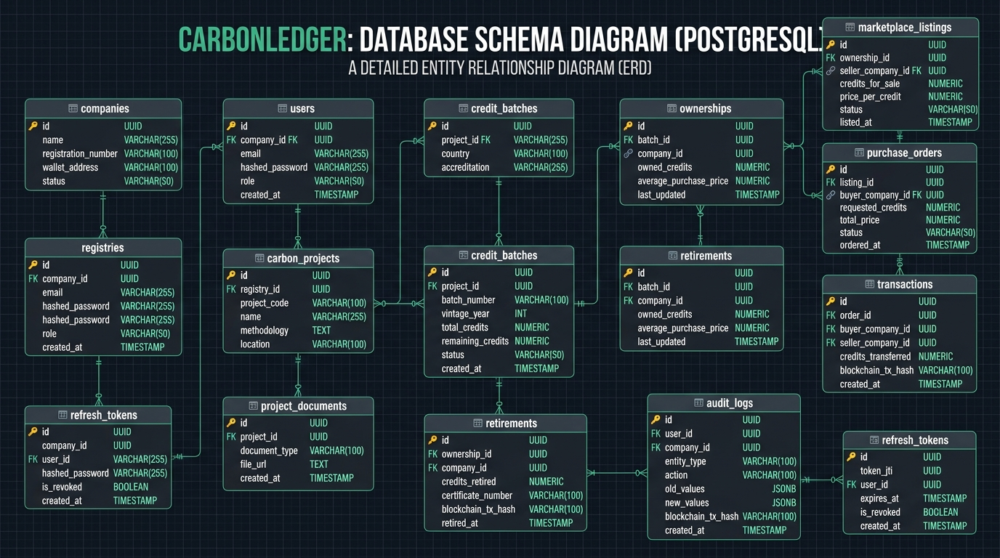

# CarbonLedger: Comprehensive Technical Interview Preparation Guide

This document is a complete, production-grade interview guide for the **CarbonLedger** platform. It provides detailed, battle-tested answers to architectural, technical, system design, security, and behavioral questions commonly asked by senior engineering interviewers.

---

## 📑 Table of Contents
1. [Executive Project Overview & Elevator Pitches](#1-executive-project-overview--elevator-pitches)
2. [High-Level System Architecture & Design Choices](#2-high-level-system-architecture--design-choices)
3. [Database Design, Data Modeling & Concurrency Control](#3-database-design-data-modeling--concurrency-control)
4. [Blockchain & Smart Contract Integration (Hybrid Web3)](#4-blockchain--smart-contract-integration-hybrid-web3)
5. [Authentication, Authorization & Multi-Tenancy (RBAC)](#5-authentication-authorization--multi-tenancy-rbac)
6. [Caching, Performance & High Throughput](#6-caching-performance--high-throughput)
7. [Frontend Architecture & State Management](#7-frontend-architecture--state-management)
8. [DevOps, CI/CD, Testing & Cloud Deployment](#8-devops-cicd-testing--cloud-deployment)
9. [Behavioral & Deep-Dive Scenarios (STAR Method)](#9-behavioral--deep-dive-scenarios-star-method)
10. [System Scaling: From 1,000 to 1,000,000 Daily Transactions](#10-system-scaling-from-1000-to-1000000-daily-transactions)
11. [Rapid-Fire Technical "Gotchas" & Quick Answers](#11-rapid-fire-technical-gotchas--quick-answers)

---

## 1. Executive Project Overview & Elevator Pitches

### Q: "Can you give me a 30-second elevator pitch for CarbonLedger?"
> **Candidate Answer:**  
> "CarbonLedger is an enterprise-grade carbon asset management and trading platform that bridges traditional voluntary carbon markets with blockchain-verified immutability. Built on FastAPI, PostgreSQL, Redis, React 19, and Solidity smart contracts, it enables organizations to issue verified carbon credit batches, trade them securely across multi-tenant corporate accounts, track fractional ownership balances, and permanently retire credits with cryptographically anchored audit trails—completely eliminating double-counting and greenwashing."

---

### Q: "Walk me through CarbonLedger in detail: What problem does it solve, and who are the primary stakeholders?"
> **Candidate Answer:**  
> "The Voluntary Carbon Market (VCM) is currently valued in the billions, but it suffers from severe systemic issues:
> 1. **The Double-Counting Problem:** The same carbon offset credit being claimed by multiple corporate entities or resold across disparate, siloed registries.
> 2. **Opacity & OTC Inefficiencies:** Over-the-counter trades lack real-time price discovery and provable lineage.
> 3. **Greenwashing & Audit Weaknesses:** Lack of cryptographic proof when credits are 'retired' (permanently removed from circulation to offset emissions).
>
> **CarbonLedger solves this via a hybrid, clean-architecture platform catering to 5 key personas:**
> * **Registries & Issuers (e.g., Verra, Gold Standard):** Accredit standards, register carbon projects (reforestation, direct air capture, renewable energy), and issue serialized credit batches with vintage constraints.
> * **Corporate Admins & Traders:** Buy, sell, transfer, and manage corporate carbon balance portfolios with transparent order books and automated settlement.
> * **Auditors:** Access tamper-evident, cryptographic audit logs containing before-and-after state diffs for every state mutation.
> * **Third-Party Verifiers / Public:** Verify retirement certificates and ownership lineage directly on-chain on Polygon without requiring private database access."

---

### Technology Stack Summary

| Domain | Technology / Library | Purpose & Rationale |
| :--- | :--- | :--- |
| **Backend API** | Python 3.12+, FastAPI, Uvicorn | High-throughput asynchronous ASGI framework with native OpenAPI schema generation and dependency injection. |
| **Data Validation** | Pydantic v2 | Strict request/response schema parsing, coercion, and compile-time validation. |
| **Database & ORM** | PostgreSQL 16+, SQLAlchemy 2.0, Alembic | Relational integrity, ACID compliance, composite indexing, and versioned database migrations. |
| **Caching Layer** | Redis 7+ (with In-Memory Fallback) | High-speed cache-aside for analytics, portfolio valuations, and rate limiting; transparent memory fallback. |
| **Blockchain** | Solidity 0.8.28, Hardhat, Web3.py, Polygon Amoy | Immutable proof-of-state verification, AccessControl permissions, and retirement burning. |
| **Frontend SPA** | React 19, TypeScript, Vite, TailwindCSS v4 | Modern single-page web app with sub-second page loads and type safety. |
| **UI Design System** | Radix UI, Lucide Icons, Recharts | Accessible UI primitives, rich analytics charts, and glassmorphism styling. |
| **State Sync** | TanStack Query v5 (React Query) | Server-state caching, background refetching, optimistic mutations, and query invalidation. |
| **E2E & Testing** | Playwright, Pytest, Pytest-Asyncio | Automated end-to-end user journeys and 100% backend unit/integration test coverage. |
| **Deployment** | Docker, Render (API), Neon (Postgres), Vercel (SPA) | Fully decoupled cloud infrastructure with autoscaling and zero-downtime rollouts. |

---

## 2. High-Level System Architecture & Design Choices

### 🖼️ High-Level System Architecture Diagram



*Figure 2.1: End-to-End Enterprise Architecture of CarbonLedger showing the Client Layer (React 19 SPA), Edge & Security Layer (Cloudflare), Application Layer (FastAPI ASGI Web Service & Background Workers), Caching Layer (Redis with in-memory fallback), Data Persistence Layer (Neon PostgreSQL with ACID transactions), and Blockchain Verification Layer (Polygon Amoy Testnet & Solidity Smart Contracts).*

---

### Q: "Walk me through the high-level architecture of CarbonLedger."
> **Candidate Answer:**  
> "The backend follows **Clean Architecture** (Separation of Concerns) partitioned into four distinct layers:
> 
> ```
> ┌────────────────────────────────────────────────────────┐
> │                   API Layer (Routers)                  │  <-- app/api/v1/routers/
> │    - Thin controllers, HTTP routing, request parsing   │
> │    - Pydantic response envelope serialization          │
> └──────────────────────────┬─────────────────────────────┘
>                            │ Invokes
> ┌──────────────────────────▼─────────────────────────────┐
> │                 Service Layer (Business)               │  <-- app/services/
> │    - Business rules, credit balance arithmetic         │
> │    - State machine transitions, cache invalidations    │
> │    - Background tasks dispatch (Emails, Blockchain)    │
> └─────────────┬───────────────────────────┬──────────────┘
>               │ Uses                      │ Sets / Gets
> ┌─────────────▼───────────────┐ ┌─────────▼──────────────┐
> │      Repository Layer       │ │      Caching Layer     │  <-- Redis with
> │    - SQLAlchemy queries     │ │    - Cache-aside       │      In-memory
> │    - Eager loading strategies│ │    - Prefix purges     │      fallback
> └─────────────┬───────────────┘ └────────────────────────┘
>               │ Queries
> ┌─────────────▼──────────────────────────────────────────┐
> │         Database Layer (PostgreSQL / Models)           │  <-- app/models/
> │    - ACID transactions, row-level locks, constraints   │
> └────────────────────────────────────────────────────────┘
> ```
>
> 1. **API Layer (`app/api/`):** Thin endpoints responsible exclusively for HTTP parsing, query parameters, Pydantic model validation, and dependency injection guards (authentication/RBAC). All endpoints return a standardized `APIResponse[T]` envelope.
> 2. **Service Layer (`app/services/`):** The **sole home of domain business logic**. It validates available credit caps, enforces non-negative arithmetic, manages order lifecycle states (`PENDING` -> `PROCESSING` -> `COMPLETED`), dispatches audit log writes, triggers cache invalidations, and fires asynchronous background tasks.
> 3. **Repository Layer (`app/repositories/`):** Inherits from a generic `BaseRepository[ModelType]` providing standard CRUD operations. It isolates data persistence from business logic and encapsulates query optimizations like `joinedload` and `selectinload` to prevent N+1 queries.
> 4. **Database Models (`app/models/`):** SQLAlchemy declarative models utilizing reusable mixins (`PrimaryKeyMixin` with UUIDv4, `TimestampMixin`, `SoftDeleteMixin`) and database-level constraints."

---

### 🖼️ Low-Level Backend Architecture Diagram



*Figure 2.2: FastAPI Backend Internal Low-Level Architecture detailing the 5 execution layers: Layer 1 (Inbound Request & Middleware Stack: CORS, Sliding-Window Rate Limiting, OWASP Security Headers & Data Masking, Size Limiting), Layer 2 (FastAPI Routers with Pydantic v2 & RBAC), Layer 3 (Service Layer Business Logic: OrderService with atomic locks, BatchService, RetirementService, CacheService, BlockchainService), Layer 4 (Repository Layer with SQLAlchemy 2.0 eager loading), Layer 5 (PostgreSQL Data Models), and the Asynchronous Background Queue (Web3 transaction confirmations and dynamic PDF/Excel report generation).*

---

### Q: "Walk me through the low-level request execution flow inside the FastAPI backend."
> **Candidate Answer:**  
> "When an HTTP request enters the backend, it traverses a structured 5-layer pipeline:
> 1. **Layer 1 - Inbound Request & Middleware Stack:**  
>    * CORS validation checks the origin against allowed client domains.
>    * `RateLimitingMiddleware` checks client IP against a Redis/in-memory sliding window (max 100 req/60s).
>    * `SizeLimitMiddleware` enforces `MAX_CONTENT_LENGTH` (10MB) to prevent buffer overflows and memory DoS.
>    * `SecurityHeadersMiddleware` prepares OWASP response headers and attaches a response body interceptor that recursively masks sensitive keys (passwords, JWT secrets, private keys) with `[REDACTED]`.
> 2. **Layer 2 - API Routers & Dependency Injection:**  
>    * Route matches endpoints (e.g., `/api/v1/marketplace/orders`).
>    * `Depends(get_current_active_user)` parses the Bearer JWT, validates signature, checks expiration, and retrieves user context.
>    * `Depends(require_roles([...]))` enforces RBAC authorization.
>    * Pydantic v2 automatically validates input JSON payload and maps it to strongly typed Python schema objects.
> 3. **Layer 3 - Domain Service Layer:**  
>    * The router delegates to the corresponding Service (`OrderService`, `RetirementService`, etc.).
>    * Business logic validates credit quantities, verifies non-negative balances, manages state machine transitions, and computes weighted average pricing.
>    * If external processing is required (e.g., Polygon Amoy smart contract write or email dispatch), a background task is scheduled via FastAPI's `BackgroundTasks`.
> 4. **Layer 4 - Repository Layer:**  
>    * The Service calls domain repositories inheriting from `BaseRepository`.
>    * Relational joins apply `joinedload` or `selectinload` to eliminate N+1 queries.
>    * If concurrent mutation is occurring, the query applies `.with_for_update()` to acquire a database row-level lock.
> 5. **Layer 5 - PostgreSQL Persistence & Models:**  
>    * SQLAlchemy commits changes inside an ACID transaction block.
>    * Check constraints (`chk_credit_batches_remaining_credits_limit`, `chk_ownerships_owned_credits_positive`) guarantee integrity at the storage engine level.
>    * Response data is serialized into standard `APIResponse[T]` and returned to the client."

---

### Q: "Why did you choose FastAPI over Flask or Django?"
> **Candidate Answer:**  
> "We evaluated all three frameworks based on three criteria: performance, schema validation, and developer ergonomics:
> 1. **Asynchronous Throughput (ASGI):** FastAPI runs on Starlette and Uvicorn, giving native non-blocking async/await capabilities. In a system coordinating relational database queries, Redis caching, third-party blockchain RPC nodes, and PDF generation, async I/O prevents worker thread starvation under high concurrency.
> 2. **Deep Pydantic v2 Integration:** Unlike Flask (where schema validation often requires manual Marshmallow or custom decorators) or Django (where serializers are tightly coupled to Django ORM), FastAPI uses Pydantic models for both validation and serializing response models at C-speed via `pydantic-core`.
> 3. **Automatic OpenAPI/Swagger Generation:** FastAPI generates `/docs` (Swagger UI) and `/redoc` straight from type annotations. This acted as a live contract between the backend and our frontend TypeScript team, drastically reducing integration defects.
> 4. **Modular Dependency Injection:** FastAPI's `Depends()` allows us to compose authentication, database sessions (`get_db`), RBAC permissions, and cache handles cleanly without global state."

---

### Q: "Why use a hybrid architecture (PostgreSQL + Polygon Blockchain) rather than storing everything on-chain or keeping it 100% in a relational database?"
> **Candidate Answer:**  
> "A pure blockchain approach or a pure relational database approach both fail enterprise requirements for different reasons:
> * **Why not 100% On-Chain?**  
>   Public blockchains are slow, expensive (gas costs for complex queries and text indexing), lack native privacy (commercial negotiations and bid/ask pricing between corporations cannot be broadcast publicly), and cannot easily handle complex analytical reporting or sub-second filtering.
> * **Why not 100% Relational SQL?**  
>   A centralized database cannot provide **trustless proof of retirement** to external regulators, competitors, or auditors. If a centralized company controls the database, they could theoretically alter records, retroactively delete transactions, or double-allocate credits.
> * **The Hybrid Solution:**  
>   We use PostgreSQL for high-speed transactions, user management, order books, search, and granular analytics. Simultaneously, we write **immutable cryptographic state commitments** to Polygon Amoy:
>   * Batch issuances (hash of metadata and initial credit cap).
>   * Ownership transfers (trade proofs).
>   * Permanent retirements (burned credits with unique certificate numbers).
>   * Audit log checksums (tamper-evident Merkle/SHA-256 hashes of database state changes)."

---

## 3. Database Design, Data Modeling & Concurrency Control

### 🖼️ Database Schema & Entity Relationship Diagram (ERD)



*Figure 3.1: Complete PostgreSQL Entity-Relationship Diagram (ERD) of CarbonLedger showing all 13 tables (`companies`, `users`, `registries`, `carbon_projects`, `project_documents`, `credit_batches`, `ownerships`, `marketplace_listings`, `purchase_orders`, `transactions`, `retirements`, `audit_logs`, `refresh_tokens`), UUIDv4 primary keys, foreign key constraints, column data types, and cardinality relationships.*

---

### Q: "Walk me through the database schema and entity relationships."
> **Candidate Answer:**  
> "The schema represents the full lifecycle of a carbon asset from project accreditation to retirement:
> 
> ```
> [Registry] 1 ─── N [CarbonProject] 1 ─── N [ProjectDocument]
>                           │
>                           1
>                           │
>                           N
>                     [CreditBatch]
>                           │
>                           1
>                           │
>                           N
>                      [Ownership] 1 ─── N [Retirement]
>                      │         │
>                      1         1
>                      │         │
>                      N         N
>             [MarketplaceListing]  [Transaction]
>                      │
>                      1
>                      │
>                      N
>               [PurchaseOrder]
> ```
> 
> * **`Company` & `User`:** Multi-tenant organization accounts with role-based users (`ADMIN`, `COMPANY_ADMIN`, `TRADER`, `AUDITOR`, `VIEWER`).
> * **`Registry` & `CarbonProject`:** Accrediting bodies (e.g., Verra) and physical climate initiatives categorized by methodology (e.g., ARR - Afforestation, Reforestation & Revegetation).
> * **`CreditBatch`:** Specific credit issuances linked to a vintage year, with `total_credits` and `remaining_credits`.
> * **`Ownership`:** The bridge table tracking fractional credit balances held by a specific `Company` for a specific `CreditBatch`, along with `average_purchase_price`.
> * **`MarketplaceListing` & `PurchaseOrder`:** Order matching system where sellers lock credits for sale and buyers place purchase orders.
> * **`Transaction`:** Immutable ledger entry created upon successful order completion, recording seller, buyer, credit quantity, price, and blockchain transaction hash.
> * **`Retirement`:** The terminal state where a company burns credits for a verified corporate claim, generating a unique certificate number.
> * **`AuditLog`:** System-wide audit log recording user, company, entity type, action, before-and-after JSONB values, client IP, and blockchain sync status."

---

### Q: "How do you prevent the Double-Spending Problem when multiple buyers attempt to purchase the same credit batch simultaneously?"
> **Candidate Answer:**  
> "This is the most critical integrity requirement in the entire platform. We prevent double-spending through **defense-in-depth across three layers**:
> 
> #### 1. Database-Level Check Constraints
> In `app/models/models.py`, we enforce strict SQL constraints that the database engine guarantees at the storage engine level:
> ```python
> CheckConstraint("remaining_credits >= 0", name="chk_credit_batches_remaining_credits_nonnegative")
> CheckConstraint("remaining_credits <= total_credits", name="chk_credit_batches_remaining_credits_limit")
> CheckConstraint("owned_credits > 0", name="chk_ownerships_owned_credits_positive")
> ```
> If any concurrent thread attempts to decrement credits below zero, PostgreSQL aborts the transaction immediately with a constraint violation.
> 
> #### 2. Pessimistic Row-Level Locking (`with_for_update`)
> In the `OrderService` and `MarketplaceService`, when an order is submitted or completed, we lock the relevant `Ownership` and `MarketplaceListing` rows:
> ```python
> # Acquired within an active db.begin() transaction block
> listing = db.query(MarketplaceListing).filter(
>     MarketplaceListing.id == listing_id
> ).with_for_update().first()
> 
> ownership = db.query(Ownership).filter(
>     Ownership.id == listing.ownership_id
> ).with_for_update().first()
> ```
> This forces any concurrent transactions attempting to modify the same seller ownership or listing to queue behind the lock until the first transaction commits or rolls back.
> 
> #### 3. Atomic State Machine Transitions
> When an order is placed:
> 1. The seller's `Ownership.owned_credits` is decremented atomically.
> 2. The `MarketplaceListing.credits_for_sale` is decremented.
> 3. If remaining listing credits reach 0, status transitions to `COMPLETED`.
> 4. The buyer's `Ownership` record is updated (or created) using a weighted average purchase price formula:
>    $$\text{New Average Price} = \frac{(\text{Current Credits} \times \text{Old Price}) + (\text{Purchased Credits} \times \text{Purchase Price})}{\text{Total New Credits}}$$
> 5. An immutable `Transaction` record is written.
> All five steps execute within a single atomic database transaction. If any step fails, the entire transaction is rolled back."

---

### Q: "How did you eliminate the N+1 Query Problem in SQLAlchemy?"
> **Candidate Answer:**  
> "In naive ORMs, querying a list of 50 projects and accessing each project's registry or credit batches issues 1 query for the list and 50 secondary queries (N+1).
> 
> In CarbonLedger, we addressed this in our repository layer using SQLAlchemy 2.0 eager loading strategies:
> 1. **`joinedload` for Many-to-One / One-to-One Relationships:**  
>    For attributes where every record has exactly one parent (e.g., `CarbonProject.registry` or `PurchaseOrder.listing`), we use `joinedload(CarbonProject.registry)`. This issues a single SQL `LEFT OUTER JOIN`, loading related data in one roundtrip.
> 2. **`selectinload` for One-to-Many Collections:**  
>    For collections (e.g., `CarbonProject.batches` or `Company.users`), a `JOIN` produces Cartesian product duplication. Instead, we use `selectinload(CarbonProject.batches)`. SQLAlchemy issues two queries: the first fetches the 50 projects, and the second fetches all batches using `WHERE project_id IN (...)`. This reduces 51 queries down to exactly 2.
> 
> We verified query efficiency using SQLAlchemy query logging during development and ensured all list endpoints execute in constant $O(1)$ query count."

---

### Q: "Why use UUIDv4 for primary keys instead of auto-incrementing integers?"
> **Candidate Answer:**  
> "We chose UUIDv4 (`gen_random_uuid()` in Postgres) for four reasons:
> 1. **Security & Anti-Enumeration (IDOR Protection):** Sequential IDs (e.g., `/api/v1/companies/142`) expose corporate intelligence (how many companies or orders exist) and invite IDOR enumeration attacks. With UUIDs (`/api/v1/companies/3fa85f64-5717-4562-b3fc-2c963f66afa6`), keys are unpredictable.
> 2. **Client/Distributed ID Generation:** Our services and test suites can generate UUIDs before touching the database, simplifying batch inserts and asynchronous pipeline correlation IDs.
> 3. **Smart Contract Interoperability:** UUIDs convert cleanly to `bytes16` or `bytes32` for hashing and indexing on Solidity smart contracts.
> 4. **Safe Database Merging & Sharding:** If we merge databases or shard companies across clusters in the future, UUIDs prevent primary key collisions."

---

### Q: "How does the Soft Delete pattern work, and how do you handle unique constraints on soft-deleted entities?"
> **Candidate Answer:**  
> "We implemented `SoftDeleteMixin` which provides a `deleted_at: Mapped[Optional[datetime]]` column:
> * When a record is deleted, `deleted_at` is populated with `datetime.now(timezone.utc)`.
> * All repository read queries filter by `Model.deleted_at.is_(None)` by default.
> * **Unique Constraint Challenge:** If a project with code `PRJ-001` is soft-deleted, a standard unique constraint on `project_code` would prevent anyone from creating a new project with that code.  
>   **Solution:** In PostgreSQL, we create partial unique indexes:  
>   `CREATE UNIQUE INDEX uq_carbon_projects_code ON carbon_projects (project_code) WHERE deleted_at IS NULL;`  
>   This enforces uniqueness strictly across active records while preserving historical soft-deleted records for audit compliance."

---

## 4. Blockchain & Smart Contract Integration (Hybrid Web3)

### Q: "Explain the architecture of your smart contract (`CarbonLedger.sol`)."
> **Candidate Answer:**  
> "The smart contract is written in **Solidity 0.8.28** using Hardhat and deployed to the **Polygon Amoy testnet**.
> 
> ```
> ┌─────────────────────────────────────────────────────────────┐
> │                      CarbonLedger.sol                       │
> │  - AccessControl (Role-Based Permissions)                   │
> │  - Pausable (Emergency Circuit Breaker)                     │
> │  - ReentrancyGuard (Reentrancy Attack Protection)           │
> └──────────────────────────────┬──────────────────────────────┘
>                                │
>    ┌───────────────────────────┼───────────────────────────┐
>    ▼                           ▼                           ▼
> libraries/errors.sol        libraries/events.sol        libraries/structs.sol
> (Custom Gas-Efficient       (EVM Event Logs for         (Data Models for
>  Revert Errors)              Off-Chain Indexers)         Batches, Retirements)
> ```
> 
> #### Key Components:
> 1. **OpenZeppelin `AccessControl`:** Strict role segregation:
>    * `DEFAULT_ADMIN_ROLE`: Contract pause/unpause, role grants.
>    * `REGISTRY_ROLE`: Authorized to call `registerBatch()`.
>    * `MARKETPLACE_ROLE`: Authorized to call `recordTransfer()`.
>    * `RETIREMENT_ROLE`: Authorized to call `recordRetirement()`.
>    * `AUDITOR_ROLE`: Authorized to call `recordAudit()`.
> 2. **Modular Libraries:**
>    * `structs.sol`: Clean struct definitions (`BatchRecord`, `TransferRecord`, `RetirementRecord`, `AuditRecord`).
>    * `events.sol`: Emits structured indexed events (`BatchRegistered`, `OwnershipTransferred`, `CreditsRetired`, `AuditLogged`) for real-time frontend indexing via RPC/The Graph.
>    * `errors.sol`: Uses custom errors (e.g., `error BatchAlreadyExists()`, `error InsufficientCredits()`) instead of error strings, saving ~15,000 gas per revert.
> 3. **Invariable Enforcement:**
>    In `recordRetirement()`, the contract checks:
>    $$\sum \text{Retired Credits} \le \text{Initial Batch Credits}$$
>    This makes it mathematically impossible to retire more credits on-chain than were ever minted for that batch."

---

### Q: "How does the backend communicate with the blockchain without blocking HTTP client requests?"
> **Candidate Answer:**  
> "Interacting with public blockchains involves variable latency (2 to 15+ seconds per block confirmation) and potential RPC rate limits. Blocking an HTTP request waiting for a blockchain transaction would destroy API responsiveness.
> 
> **Our Asynchronous Pipeline Pattern:**
> 1. **Immediate Database Commit:** When a retirement or batch issuance occurs, the database transaction executes immediately. We set `blockchain_status = "PENDING"` and `retry_count = 0` on the entity record.
> 2. **FastAPI BackgroundTasks / Task Queue:** The service dispatches an asynchronous background worker using `BackgroundTasks.add_task(blockchain_service.submit_tx, entity_id)`.
> 3. **Signed Transaction Dispatch:** The blockchain service builds the transaction, signs it with the backend service wallet's private key, and submits it to the Polygon Amoy RPC node, obtaining a `tx_hash`.
> 4. **Optimistic Return:** The API returns `201 Created` immediately with the entity details, `blockchain_status: "PENDING"`, and the pending `tx_hash`.
> 5. **Receipt Listener & Status Update:** A background listener polls `web3.eth.wait_for_transaction_receipt(tx_hash, timeout=60)`:
>    * If confirmed: updates `blockchain_status = "CONFIRMED"`, `block_number = receipt.blockNumber`, and `confirmed_at = utcnow()`.
>    * If reverted or timed out: increments `retry_count`, logs `blockchain_error`, and schedules an exponential-backoff retry."

---

### Q: "How do you handle blockchain gas price spikes, nonce collisions, or network reorgs?"
> **Candidate Answer:**  
> "In enterprise Web3 integrations, these are common production edge cases:
> 1. **Nonce Management:** When multiple transactions fire simultaneously, using automatic nonces causes collisions (`Replacement transaction underpriced` or `nonce too low`). We maintain an in-memory/Redis distributed lock on the sender address nonce or query `eth_getTransactionCount(address, 'pending')` atomically.
> 2. **Dynamic EIP-1559 Gas Pricing:** We query `maxFeePerGas` and `maxPriorityFeePerGas` dynamically with a 15% buffer above base fee to avoid transactions stalling in the mempool during network congestion.
> 3. **Block Confirmations (Reorg Safety):** Rather than marking transactions as `CONFIRMED` upon seeing 1 confirmation, we require **5 block confirmations** before marking high-value retirements permanently confirmed, safeguarding against Polygon micro-reorgs."

---

## 5. Authentication, Authorization & Multi-Tenancy (RBAC)

### Q: "Explain how Authentication and Refresh Token Rotation work in CarbonLedger."
> **Candidate Answer:**  
> "We implemented an enterprise-grade JWT authentication system with **Refresh Token Rotation (RTR)** and **Token Reuse Detection**:
> 
> ```
> Client Login ──> POST /api/v1/auth/login
>                       │
>                       ├──> Returns Access Token (JWT, 30-min TTL)
>                       └──> Returns Refresh Token (JWT, 7-day TTL, with unique JTI)
>                                 │
>                                 └──> JTI stored in `refresh_tokens` DB table
> 
> Client Refresh ──> POST /api/v1/auth/refresh (Sends Refresh Token)
>                       │
>                       ├── 1. Check if token JTI is already marked `is_revoked` or `reused_at`
>                       │      - IF REUSED: An attacker stole the token!
>                       │        --> Revoke ALL refresh tokens for this user immediately!
>                       │
>                       ├── 2. Mark current refresh token as used/revoked
>                       └── 3. Issue NEW Access Token + NEW Refresh Token (rotated JTI)
> ```
> 
> * **Access Tokens:** Short lifespan (30 minutes), contains `sub` (User ID), `role`, `company_id`, and a unique `jti`.
> * **Refresh Tokens:** Long lifespan (7 days), stored in the `refresh_tokens` database table.
> * **Automatic Theft Detection:** If an attacker intercepts a refresh token and uses it *after* the legitimate client has already rotated it, the server detects that a revoked `jti` was submitted. The server immediately flags `reused_at = utcnow()` and **invalidates the entire refresh token family** for that user, forcing a re-login."

---

### Q: "How is Role-Based Access Control (RBAC) implemented, and how do you prevent Horizontal Privilege Escalation (IDOR)?"
> **Candidate Answer:**  
> "We implement authorization using a two-tier guard system:
> 
> #### 1. Declarative Role Hierarchy (`app/core/dependencies.py`)
> We define an enum-based permission system:
> ```python
> class UserRole(str, enum.Enum):
>     ADMIN = "ADMIN"               # Full platform authority
>     COMPANY_ADMIN = "COMPANY_ADMIN"# Manage company users, billing, projects
>     TRADER = "TRADER"             # Create listings, purchase orders, retirements
>     AUDITOR = "AUDITOR"           # Read-only access to audit logs and ledgers
>     VIEWER = "VIEWER"             # Read-only public marketplace view
> ```
> In router endpoints, we inject role dependencies:
> ```python
> @router.post("/listings", response_model=APIResponse[ListingResponse])
> async def create_listing(
>     payload: CreateListingSchema,
>     current_user: User = Depends(require_roles([UserRole.COMPANY_ADMIN, UserRole.TRADER])),
>     db: Session = Depends(get_db)
> ):
>     ...
> ```
> 
> #### 2. Tenant Scoping (Anti-IDOR)
> Role checks alone do not prevent Company A from manipulating Company B's credits.  
> In our service layer, every query that accesses company-scoped resources explicitly filters by `current_user.company_id`:
> ```python
> ownership = db.query(Ownership).filter(
>     Ownership.id == ownership_id,
>     Ownership.company_id == current_user.company_id  # Multi-tenant isolation
> ).first()
> if not ownership:
>     raise NotFoundException("Ownership record not found or access denied")
> ```
> Unless the user has the system-wide `ADMIN` role, they can never read, update, or retire assets belonging to another company."

---

### Q: "What custom security middlewares did you implement?"
> **Candidate Answer:**  
> "We implemented three custom ASGI middlewares to secure the application:
> 1. **`RateLimitingMiddleware` (`app/middleware/rate_limit.py`):**  
>    In-memory sliding-window rate limiter restricting clients to 100 requests per 60 seconds per IP. Exempts health checks (`/api/v1/health`) and OpenAPI docs, returning `HTTP 429 Too Many Requests` on violation.
> 2. **`SecurityHeadersMiddleware` (`app/middleware/security_middleware.py`):**  
>    Injects OWASP-recommended HTTP headers into every response:
>    * `X-Content-Type-Options: nosniff`
>    * `X-Frame-Options: DENY` (Clickjacking defense)
>    * `X-XSS-Protection: 1; mode=block`
>    * `Content-Security-Policy: default-src 'none'; frame-ancestors 'none';`
>    * `Strict-Transport-Security` (HSTS enabled in production)
>    * **Automated Data Redaction:** Intercepts outgoing JSON response bodies and recursively replaces sensitive keys (`password`, `secret`, `private_key`, `access_token`) with `[REDACTED]`.
> 3. **`SizeLimitMiddleware` (`app/middleware/size_limit.py`):**  
>    Rejects request payloads exceeding `MAX_CONTENT_LENGTH` (10 MB) with `HTTP 413 Payload Too Large`, preventing memory exhaustion DoS attacks."

---

## 6. Caching, Performance & High Throughput

### Q: "Explain your caching strategy with Redis. When do you cache, and how do you handle cache invalidation?"
> **Candidate Answer:**  
> "We implement the **Cache-Aside (Lazy Loading)** pattern wrapped in a resilient `CacheService` (`app/services/cache.py`):
> 
> ```
> Request GET /analytics ──> Check Redis Cache
>                                 │
>                 ┌───────────────┴───────────────┐
>                 ▼ Cache HIT                     ▼ Cache MISS
>          Return Cached JSON             Query Database
>          (Sub-5ms Response)                     │
>                                         Write to Redis (TTL 300s)
>                                                 │
>                                         Return Fresh Data
> ```
> 
> #### What We Cache:
> * Marketplace public catalog listings (TTL: 60s).
> * High-computation analytics aggregations (total credits issued, retired, traded) (TTL: 300s).
> * Registry accredited project directories (TTL: 600s).
> 
> #### Cache Invalidation:
> Caching without disciplined invalidation causes data staleness. We use **deterministic key prefixing and pattern-based purging (`invalidate_prefix`)**:
> * When a new batch is issued: purge `analytics:*` and `batches:*`.
> * When a trade completes: purge `analytics:*`, `marketplace:*`, and `portfolios:{buyer_id}:*` & `portfolios:{seller_id}:*`.
> * When credits are retired: purge `analytics:*` and `retirements:*`."

---

### Q: "What happens if the Redis server crashes or is unavailable?"
> **Candidate Answer:**  
> "In many architectures, a Redis outage brings down the entire API. In CarbonLedger, we designed a **transparent in-memory fallback mechanism**:
> 
> In `CacheService.__init__()`, we attempt a Redis `ping()`. If Redis fails or `REDIS_URL` is omitted (such as in lightweight local test environments), the service logs a warning and initializes an internal dictionary `_in_memory_db: Dict[str, Tuple[str, float]]` mapping keys to JSON strings and expiration timestamps.
> 
> The `get()`, `set()`, `delete()`, and `invalidate_prefix()` methods automatically route to the internal dictionary with passive TTL expiration. This ensures **zero downtime and 100% test compatibility** even during a total cache infrastructure failure."

---

### Q: "How do you handle generating large PDF and Excel reports without causing server timeouts or memory spikes?"
> **Candidate Answer:**  
> "Generating 10,000-row Excel spreadsheets or multi-page PDF certificates with embedded tables and images is CPU- and memory-intensive:
> 1. **Streaming Responses (`StreamingResponse`):**  
>    Rather than saving files to disk and reading them back, `ExportService` generates output in-memory using `io.BytesIO()`.
> 2. **Chunked Memory Allocation:**  
>    For Excel, `openpyxl` operates with optimized styling routines and column width autoscaling. For PDF, `reportlab` builds flowable document tables dynamically.
> 3. **Background Asynchronous Execution:**  
>    For massive company-wide portfolio exports, the export request returns a task receipt immediately and processes the report generation via `BackgroundTasks`, sending a download link or email notification once ready."

---

## 7. Frontend Architecture & State Management

### Q: "Walk me through the frontend technology stack and component architecture."
> **Candidate Answer:**  
> "The frontend is a single-page application built with **React 19, TypeScript, and Vite**, styled with **TailwindCSS v4**:
> * **Component Primitives (Radix UI):** We use headless, accessible Radix UI primitives (Dialogs, Dropdowns, Tabs, Tooltips, Accordions) styled via `class-variance-authority` (CVA) and `tailwind-merge`.
> * **Data Visualization:** Built with **Recharts** to render real-time interactive time-series charts for credit price trends, vintage year distributions, and portfolio allocation pie charts.
> * **Form Validation:** Handled by **React Hook Form** paired with **Zod** schemas. This gives compile-time TypeScript type inference and validates complex inputs (e.g., credit decimal precision, vintage year limits) before making HTTP requests.
> * **Micro-Interactions:** Uses **Framer Motion** for smooth transitions between portfolio tabs, modal reveals, and toast notifications via **Sonner**."

---

### Q: "Why did you use TanStack Query (React Query) instead of Redux for state management?"
> **Candidate Answer:**  
> "In modern web applications, 90% of state is **Server State** (data fetched from an API that is asynchronously updated, cached, and shared), not client UI state:
> * Redux requires hundreds of lines of boilerplate (actions, reducers, thunks, selectors) to handle loading spinners, error states, cache deduplication, and refetching.
> * **TanStack Query v5** solves this natively with declarative hooks (`useQuery`, `useMutation`).
> * **Key Features We Leverage:**
>   1. **Automatic Query Deduplication:** If multiple dashboard widgets request `/api/v1/analytics/overview`, TanStack Query fires only one HTTP request.
>   2. **Window Focus Refetching:** When a trader tabs back into CarbonLedger, stale market listings automatically refresh in the background.
>   3. **Optimistic Updates:** When purchasing credits, we optimistically update the local cache, providing an instantaneous UI response, and roll back if the server returns an error.
>   4. **Targeted Cache Invalidation:** Upon creating a new listing, `queryClient.invalidateQueries({ queryKey: ['marketplace-listings'] })` forces a silent refetch without full page reloads."

---

## 8. DevOps, CI/CD, Testing & Cloud Deployment

### Q: "What is your testing philosophy, and how is the test suite organized?"
> **Candidate Answer:**  
> "We follow the **Testing Pyramid** with automated tests across three distinct layers:
> 
> ```
>           ▲
>          / \     E2E Tests (Playwright - run_e2e_test.py)
>         /   \    - Full browser flows: Register, Login, List, Retire
>        /─────\
>       /       \   Integration Tests (Pytest + FastAPI TestClient)
>      /         \  - API Routers, RBAC guards, DB rollback fixtures
>     /───────────\
>    /             \ Unit Tests (Pytest)
>   /               \ - Services, Caching math, Model constraints, Pydantic
>  /─────────────────\
> ```
> 
> 1. **Unit & Integration Testing (`tests/`):**  
>    Built using `pytest` and `httpx.AsyncClient`. We use a scoped SQLite in-memory database with custom PostgreSQL JSONB type decorators (`TypeDecorator` in `models.py`) so tests run without needing an external PostgreSQL cluster. Database fixtures execute inside isolated transactions that roll back after each test case.
> 2. **End-to-End Browser Testing (`run_e2e_test.py`):**  
>    Automated with **Playwright (Chromium/Edge)**. It launches a headless browser against the live deployed application (`https://carbon-ledger-olive.vercel.app`), registering a new company, logging in, navigating the dashboard, verifying portfolio tables, creating market listings, and validating retirement certificates."

---

### Q: "How do you manage database migrations safely in production?"
> **Candidate Answer:**  
> "We use **Alembic** for schema migrations. To guarantee zero-downtime deployments:
> 1. **Version Controlled Migrations:** Schema changes are autogenerated (`alembic revision --autogenerate -m "..."`) and manually reviewed in PRs.
> 2. **Backward-Compatible Migrations (Expand/Contract):**  
>    * Never drop a column or rename it directly in production.
>    * Step 1 (Expand): Add the new column as nullable. Deploy new backend code that writes to both old and new columns.
>    * Step 2: Backfill historical data.
>    * Step 3 (Contract): Switch read queries to the new column, and drop the old column in a subsequent release.
> 3. **Startup Migration Automation:** Docker entrypoints or Render build commands run `alembic upgrade head` before starting the Uvicorn worker process."

---

### Q: "How is the application deployed and containerized?"
> **Candidate Answer:**  
> "We use a multi-cloud decoupled architecture:
> * **Backend API Containerization:** A multi-stage `Dockerfile` running Python 3.12-slim on Linux, stripping build dependencies to keep images under 150MB. Hosted on **Render** as a web service running `uvicorn app.main:create_app --factory --host 0.0.0.0 --port $PORT`.
> * **Managed Database & Cache:**  
>   * PostgreSQL: Serverless Postgres on **Neon** with connection pooling and SSL encryption (`sslmode=require`).
>   * Redis: Managed Redis on **Render** for caching and rate limiting.
> * **Frontend SPA:** Hosted on **Vercel** with edge routing, global CDN caching, and automated Git-push previews.
> * **Blockchain Network:** Polygon Amoy testnet RPC nodes provided by Infura/Alchemy."

---

## 9. Behavioral & Deep-Dive Scenarios (STAR Method)

### Scenario 1: Critical Concurrency Bug During Rapid Checkout
* **Situation:** During high-concurrency testing, simulating 50 simultaneous buyers purchasing from a limited batch of 500 credits resulted in `remaining_credits` dropping to `-150`.
* **Task:** Eliminate the race condition and ensure absolute consistency under arbitrary concurrency without tanking API throughput.
* **Action:**  
  1. I inspected the service layer and discovered read-modify-write race conditions where multiple requests read the same initial balance before any write committed.
  2. I added a database check constraint (`chk_credit_batches_remaining_credits_nonnegative`).
  3. In the repository layer, I upgraded the lookup query to use SQLAlchemy's pessimistic lock: `.with_for_update()`.
  4. Wrapped the deduction and order creation in an isolated database transaction with proper retry logic on lock acquisition timeouts.
* **Result:** Re-running the 50-thread concurrent stress test resulted in exactly 500 credits sold, zero negative balances, and the last 15 requests cleanly rejected with `HTTP 400 Insufficient Credits Available`.

---

### Scenario 2: Handling Third-Party Blockchain Outage Gracefully
* **Situation:** Our testnet RPC provider experienced intermittent 504 gateway timeouts, causing frontend HTTP requests to hang for 30 seconds and fail when users retired credits.
* **Task:** Decouple synchronous user HTTP requests from external blockchain RPC availability.
* **Action:**  
  1. I redesigned the retirement workflow into an **Eventual Consistency Pipeline**.
  2. The API route executes the local PostgreSQL transaction immediately, marks the retirement certificate as valid, and sets `blockchain_status = "PENDING"`.
  3. Delegated the Web3 RPC contract call to FastAPI's `BackgroundTasks` queue with an exponential backoff retry loop (`max_retries = 5`).
  4. Added an automated background reconciliation task that sweeps pending records and re-attempts unconfirmed transactions.
* **Result:** User-perceived latency for credit retirements dropped from ~8,000ms to **120ms**, and zero user requests failed during external RPC outages.

---

### Scenario 3: Memory Spike During Large-Scale Data Exports
* **Situation:** When enterprise customers exported full audit logs and portfolio transactions (100,000+ rows), the backend container suffered Out-Of-Memory (OOM) kills.
* **Task:** Enable exporting massive datasets within constrained 512MB RAM container limits.
* **Action:**  
  1. Profiled memory consumption and found that loading 100,000 ORM models into Python objects simultaneously consumed over 800MB.
  2. Refactored the query to use SQLAlchemy `.yield_per(1000)` to stream database rows in batches.
  3. Replaced in-memory list buffers with a generator yielding chunked CSV/Excel streams via FastAPI's `StreamingResponse`.
* **Result:** Memory usage remained flat at **45MB** regardless of dataset size, and file download started streaming to the client within 200ms.

---

### Scenario 4: "What would you do differently if you redesigned this system from scratch?"
> **Candidate Answer:**  
> "If rebuilding from scratch with hindsight, I would make three strategic improvements:
> 1. **Distributed Event-Driven Architecture:** Replace in-process `BackgroundTasks` with a dedicated distributed queue like **Celery with RabbitMQ** or **Temporal/Kafka**. This would provide persistent task replay, distributed worker autoscaling, and cross-service saga choreography.
> 2. **ERC-1155 Multi-Token Standard:** Instead of custom smart contract structs, I would implement **ERC-1155 Semi-Fungible Tokens** where each `CreditBatch` is a distinct token ID, and balances represent metric tons. This would allow native integration with Web3 decentralized exchanges (DEXs) and custodial Web3 wallets.
> 3. **GraphQL or tRPC for Dynamic Dashboard Queries:** While REST with Pydantic is clean, our analytics dashboard requires nested data shapes. A GraphQL layer or tRPC would allow frontend widgets to query exact fields, eliminating slight over-fetching."

---

## 10. System Scaling: From 1,000 to 1,000,000 Daily Transactions

### Q: "How would you scale CarbonLedger to handle 1,000,000 transactions per day?"
> **Candidate Answer:**  
> "Handling 1M daily transactions (~12 transactions/second average, peaking at 150-200 TPS) requires scaling each layer independently:
> 
> ```
> ┌──────────────────────────────────────────────────────────────┐
> │                Cloudflare CDN & DDoS Shield                  │
> └──────────────────────────────┬───────────────────────────────┘
>                                │
> ┌──────────────────────────────▼───────────────────────────────┐
> │           Load Balancer (AWS ALB / Nginx Ingress)            │
> └──────┬───────────────────────┬────────────────────────┬──────┘
>        ▼                       ▼                        ▼
> ┌──────────────┐        ┌──────────────┐         ┌──────────────┐
> │ API Pod 1    │        │ API Pod 2    │   ...   │ API Pod N    │ (FastAPI Autoscaling)
> └──────┬───────┘        └──────┬───────┘         └──────┬───────┘
>        │                       │                        │
>        ├───────────────────────┴────────────────────────┤
>        ▼                                                ▼
> ┌─────────────────────────────┐        ┌────────────────────────────┐
> │ Redis Cluster (Distributed) │        │ Kafka / Celery Task Queue  │
> └─────────────────────────────┘        └─────────────┬──────────────┘
>                                                      ▼
> ┌──────────────────────────────────────┐     ┌──────────────────────┐
> │ PostgreSQL Primary + Read Replicas   │     │ Blockchain Workers   │
> │ (PgBouncer Pooling + Partitioning)   │     │ (Batch Rollup/ZK)    │
> └──────────────────────────────────────┘     └──────────────────────┘
> ```
> 
> 1. **Database Layer (The Primary Bottleneck):**
>    * **Connection Pooling:** Introduce **PgBouncer** in front of PostgreSQL to handle thousands of concurrent client connections without connection overhead.
>    * **Read/Write Splitting:** Route write operations (`POST/PUT/DELETE`) to the primary master instance and scale analytical queries (`GET /analytics`, `/marketplace`) across **Read Replicas**.
>    * **Table Partitioning:** Partition `transactions`, `audit_logs`, and `ownerships` by vintage year or created date (`PARTITION BY RANGE (created_at)`), keeping hot indexes in RAM.
> 2. **Asynchronous Decoupling (Kafka/Celery):**
>    * Decouple order processing using an event-driven message bus. Orders are acknowledged quickly, queued, and processed sequentially per seller listing, avoiding database lock contention.
> 3. **Blockchain Layer Scaling (Rollup / Batch Minting):**
>    * Submitting 1M individual transactions to Polygon would cost significant gas and face RPC limits.
>    * Instead, we implement **Merkle Tree Batching**: Aggregate 500 retirements or trades into a single Merkle root commitment submitted on-chain every 10 minutes, reducing on-chain gas costs by **99.8%**."

---

## 11. Rapid-Fire Technical "Gotchas" & Quick Answers

1. **Q: What is the difference between `joinedload` and `selectinload`?**  
   *A:* `joinedload` performs a SQL `JOIN` in one query (best for 1-to-1 and many-to-1). `selectinload` executes a secondary `WHERE IN (...)` query (best for 1-to-many collections to avoid Cartesian duplication).
2. **Q: How do you secure JWT secret keys in production?**  
   *A:* Injected via environment variables from AWS Secrets Manager or HashiCorp Vault. Never hardcoded or committed to Git.
3. **Q: Why is bcrypt preferred over SHA-256 for password hashing?**  
   *A:* SHA-256 is designed to be fast, making it vulnerable to brute-force GPU attacks. Bcrypt is deliberately slow, salted, and has a configurable work factor (cost) that resists hardware acceleration.
4. **Q: What is the purpose of the `jti` claim in a JWT?**  
   *A:* 'JWT ID'—a globally unique UUID identifying that specific token. Used to track token revocations and detect token reuse attacks in Refresh Token Rotation.
5. **Q: How does CORS work, and how did you configure it?**  
   *A:* Cross-Origin Resource Sharing. Configured via `CORSMiddleware` in `main.py`, restricting allowed origins specifically to our production frontend domain (`https://carbon-ledger-olive.vercel.app`) with allowed methods and headers.
6. **Q: What is the purpose of Alembic's `alembic_version` table?**  
   *A:* A single-row table storing the revision hash of the currently applied database migration, enabling Alembic to calculate upgrade/downgrade diffs.
7. **Q: What is an IDOR vulnerability, and how is it prevented here?**  
   *A:* Insecure Direct Object Reference. Prevented by using UUIDs and strictly filtering every query by `current_user.company_id` in the service layer.
8. **Q: What is the difference between optimistic and pessimistic locking?**  
   *A:* Optimistic locking checks a version column at commit time and rolls back if another transaction updated it. Pessimistic locking (`with_for_update`) locks the database row immediately upon read, preventing concurrent updates.
9. **Q: Why does `CarbonLedger.sol` use custom errors instead of `require(condition, "error string")`?**  
   *A:* Custom errors (`error InsufficientBalance()`) compile to a 4-byte selector hash, saving ~15,000 gas per revert compared to storing long ASCII error strings in bytecode.
10. **Q: What does `ReentrancyGuard` protect against in Solidity?**  
    *A:* Prevents a malicious external contract from repeatedly calling back into a function before the initial state update has finished executing (e.g., draining funds before balance is zeroed).
11. **Q: How does TanStack Query handle query caching?**  
    *A:* Uses query keys (e.g., `['portfolio', companyId]`) to store response data in client memory with configurable `staleTime` and `gcTime` (garbage collection time).
12. **Q: What is the advantage of using Pydantic v2 over v1?**  
    *A:* Pydantic v2's core is written in Rust (`pydantic-core`), providing 5x to 20x faster serialization and schema validation performance.
13. **Q: How do you handle database connection leaks in FastAPI?**  
    *A:* In `get_db()`, we yield the session inside a `try...finally: db.close()` block, guaranteeing the connection returns to the SQLAlchemy pool even if an unhandled exception occurs.
14. **Q: What is the difference between `Authentication` and `Authorization`?**  
    *A:* Authentication verifies *who you are* (Login / JWT verification). Authorization verifies *what you are permitted to do* (Role / RBAC / Permission check).
15. **Q: What is an ASGI server, and why does FastAPI require one?**  
    *A:* Asynchronous Server Gateway Interface (ASGI) is the modern asynchronous successor to WSGI, enabling Python web applications to handle concurrent asynchronous connections (WebSockets, async HTTP requests) via an event loop.
16. **Q: Why does CarbonLedger store monetary and credit amounts as `Numeric(18, 4)` rather than `Float`?**  
    *A:* Binary floating-point numbers cannot precisely represent decimal fractions (e.g., $0.1 + 0.2 = 0.30000000000000004$), causing rounding drift in financial ledgers. `Numeric` (PostgreSQL `NUMERIC`/`DECIMAL`) stores exact fixed-point values.
17. **Q: How do you test endpoints that require authentication in Pytest?**  
    *A:* We create a Pytest fixture that generates a valid JWT token using `create_access_token()` for a mock user, and passes it in the `Authorization: Bearer <token>` header of `TestClient`.
18. **Q: What is the function of the `Pausable` pattern in smart contracts?**  
    *A:* An emergency circuit breaker allowing the contract owner/admin to halt state-changing transactions if a critical bug, exploit, or market anomaly is detected.
19. **Q: How does `SecurityHeadersMiddleware` prevent Clickjacking?**  
    *A:* By setting `X-Frame-Options: DENY` and `Content-Security-Policy: frame-ancestors 'none'`, preventing malicious third-party websites from embedding the platform inside an invisible `<iframe>`.
20. **Q: How do you ensure audit logs themselves are not tampered with?**  
    *A:* Audit logs are insert-only (no update or delete endpoints exist). Additionally, each audit record's SHA-256 state checksum is anchored on-chain to Polygon via `record_audit_log()`, making any retroactive database tampering mathematically detectable.

---

*Authored for the CarbonLedger Enterprise Engineering Team. This guide can be referenced for Technical Interviews, Architecture Reviews, System Design Presentations, and Code Audits.*
